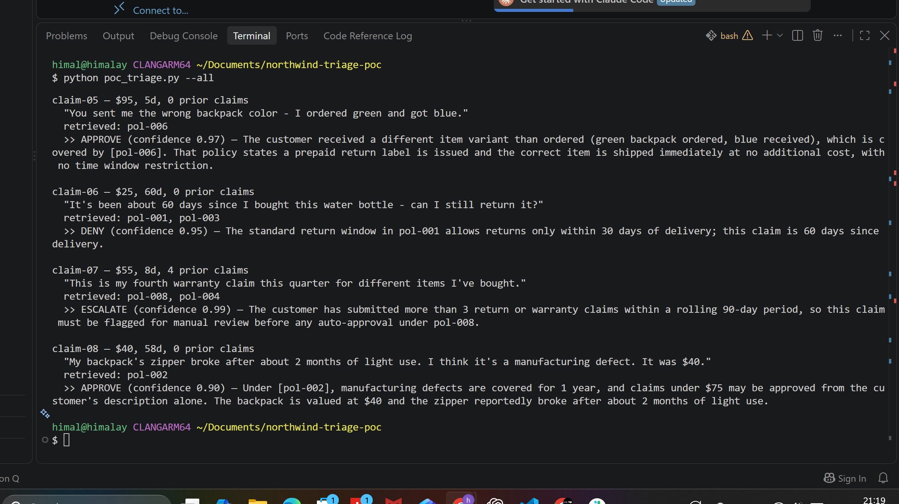

# Northwind Returns & Warranty Triage Agent

An end-to-end FDE (Forward Deployed Engineering) case study: taking a vague
internal-tooling problem — *"our returns team is backed up"* — through
reframing, architecture, a proof of concept, an MVP with real guardrails,
and an honest accounting of what's still missing before production.

**Northwind Outdoor Gear is a fictional client.** This is a synthetic
take-home exercise I completed to practice the full FDE build cycle: problem
framing → architecture → POC → MVP, plus a second pass applying a
5-part methodology (reframe → eval design → architecture → implementation
plan → prove it) on top of that.

---

## The shape of the problem

Northwind's 4-person returns team handles ~200 return/warranty claims a
week, submitted as free text plus a few structured fields (item value, days
since delivery, prior claims in 90 days). Every claim — a one-sentence size
exchange or a genuine judgment call — waits in the same undifferentiated
queue. The actual problem isn't "the team is slow," it's that there's no
triage step separating the routine majority from the genuine exceptions.

## What's in this repo

| Folder | What it is |
|---|---|
| [`docs/`](./docs) | The written discovery note, architecture diagram, and the FDE-framework write-up (reframe, eval design / troubleshooting, Gen-4 architecture, implementation plan, and the honest "prove it" reflection) |
| [`docs/diagrams/`](./docs/diagrams) | Standalone architecture, Gen-4 layer, backend/services, and timeline diagrams |
| [`poc/`](./poc) | The POC — a real script that retrieves policy text and makes one grounded LLM call to decide approve/deny/escalate |
| [`console/`](./console) | The MVP — an interactive, standalone HTML console with hard-coded guardrails, a claim state object, and a full visible reasoning trace per claim |
| [`screenshots/`](./screenshots) | Real output from an actual run (not mocked) |

## The core design decision

The whole build turns on one idea: **a guardrail only counts if it's
enforced in code the model can't argue its way around, not as an instruction
in a prompt.** Two rules are hard-coded ahead of any LLM call:

- item value ≥ $150 → always escalate
- more than 3 prior claims in 90 days → always escalate

Everything else — retrieval, the actual approve/deny/escalate reasoning —
is a single LLM call, grounded only in the policy text retrieved for that
specific claim, never trusted to invent policy or override the hard rules.

```
Claim → guardrail pre-check (code) → retrieval (keyword match vs. policy KB)
      → decision agent (1 LLM call) → guardrail post-check (code) → action
```

Full diagram: [`docs/diagrams/architecture_diagram.png`](./docs/diagrams/architecture_diagram.png)

## Proof it actually runs


```
$ python poc_triage.py --all
```



*Real output from an actual OpenAI API call — not a mocked response.* One
finding worth calling out: on `claim-04` (an item marked "clearance," return
requested), the model didn't pattern-match the word "clearance" straight to
a denial — it noticed the claim text never states whether the 50%-off
threshold that actually triggers the final-sale exclusion applies, and
escalated rather than guess. That's the kind of calibrated caution the
[Design the Eval](./docs/Northwind_FDE_Framework_Application.docx) section
was written to watch for.

## Quickstart

**Run the POC script** (needs your own OpenAI API key):
```bash
cd poc
pip install openai
export OPENAI_API_KEY="sk-..."
python poc_triage.py --all
```

**Run the MVP console** — just open `console/triage_console_share.html` in
any browser, paste in your own API key (OpenAI or Anthropic) in the panel
at the top, and click "Run MVP." No install required.

## Honest gaps — what this is *not*

This is a POC/MVP, not a production system, and pretending otherwise would
defeat the point of the exercise. Named explicitly in
[`docs/Northwind_FDE_Framework_Application.docx`](./docs/Northwind_FDE_Framework_Application.docx):

- **No memory.** The agent doesn't persist anything about a customer or a
  past decision between runs — `prior_claims_90d` arrives as a static field
  from an upstream system, but the agent itself learns nothing over time.
- **No feedback loop.** A trace is written for every claim, but nothing
  currently reads it back into future decisions.
- **Backend actions are simulated**, not wired to a real order-management
  system, ticketing tool, or notification service — see the components
  table and the backend/services diagram for what a real deployment would
  need to add, and roughly how long each stage (staging, phased production)
  would realistically take.

## Methodology

Built and documented using a 5-part FDE framework: **Problem Reframing**
(the Four Levers, forced into a fixed "X lacks Y because Z, we'll build W"
sentence) → **Design the Eval** (naming failure modes before writing code,
cheapest-fix-first) → **Gen-4 Architecture** (Retrieval / Context / Memory /
Feedback, including naming which layers aren't real yet) → **Implementation
Plan** (components, priorities, a realistic staged timeline) → **Prove It**
(what actually changed, scored honestly).

---

*Synthetic client, synthetic data, real code and a real API call. Built as
a demonstration of end-to-end FDE thinking — problem framing through a
working, guarded, honestly-scoped system.*
